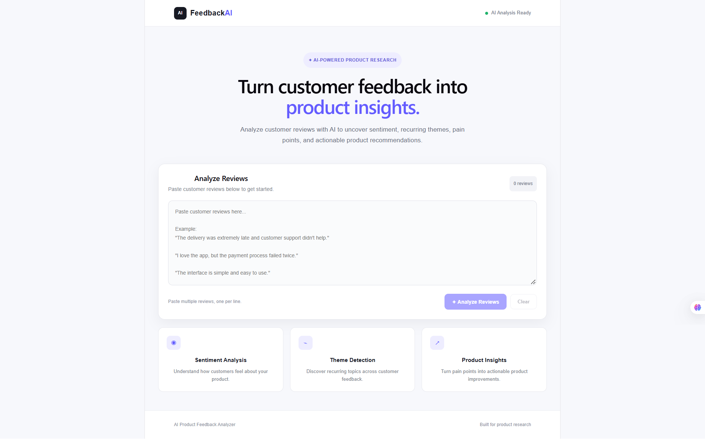
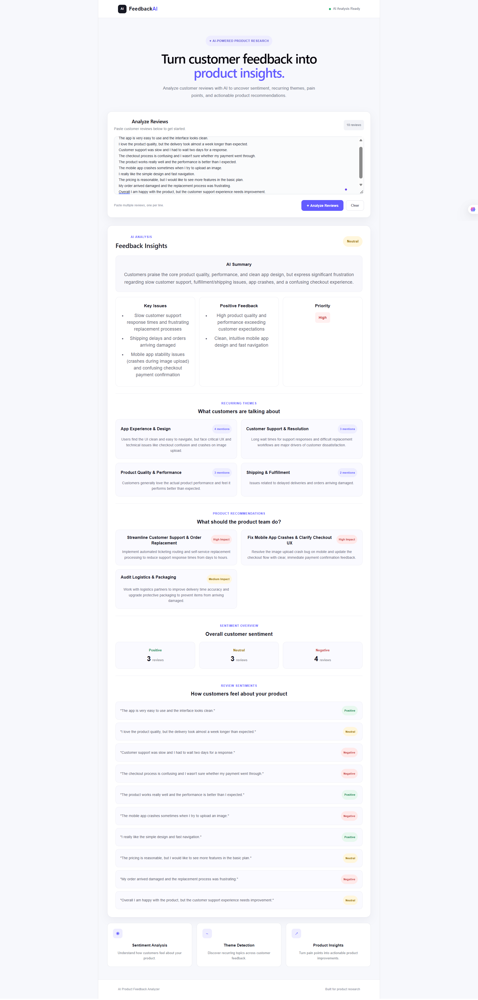

# AI Product Feedback Analyzer

A full-stack web application that analyzes customer reviews using Google Gemini and converts them into structured product insights.

Paste multiple customer reviews and get sentiment analysis, key issues, recurring themes, positive feedback, product recommendations, and sentiment classification for each review.

## Live Demo

[AI Product Feedback Analyzer](https://ai-product-feedback-analyzer.vercel.app)

## Features

- Overall sentiment analysis
- AI-generated feedback summary
- Key issue detection
- Positive feedback extraction
- Product priority identification
- Recurring theme detection with mention counts
- Product improvement recommendations
- Individual review sentiment classification
- Sentiment distribution
- Responsive interface
- Clear and reset analysis

## Tech Stack

### Frontend

- React
- Vite
- JavaScript
- CSS

### Backend

- Node.js
- Express.js
- Google Gemini API
- @google/genai
- CORS
- dotenv

## Architecture

```text
Customer Reviews
       |
       v
React Frontend
       |
       v
Express.js Backend
       |
       v
Google Gemini API
       |
       v
Structured JSON Response
       |
       v
Insights Dashboard
```

## What the Analyzer Produces

### Overall Sentiment

Classifies the overall customer feedback as:

- Positive
- Neutral
- Negative

### Key Issues

Identifies the main problems and pain points mentioned in the reviews.

### Positive Feedback

Highlights the aspects of the product that customers like.

### Recurring Themes

Groups related feedback into themes and estimates how many reviews mention each theme.

### Product Recommendations

Generates practical product improvement recommendations based on the issues and recurring themes found in the reviews.

### Review Sentiments

Classifies each individual review as Positive, Neutral, or Negative.

### Sentiment Distribution

Shows the distribution of positive, neutral, and negative reviews.

## Project Structure

```text
ai-product-feedback-analyzer/
|
├── public/
├── Screenshots/
├── server/
│   ├── server.js
│   ├── package.json
│   └── .env
|
├── src/
│   ├── App.jsx
│   └── App.css
|
├── .gitignore
├── README.md
├── package.json
└── vite.config.js
```

## Run Locally

### 1. Clone the repository

```bash
git clone https://github.com/ShashankGangwar11/ai-product-feedback-analyzer.git
cd ai-product-feedback-analyzer
```

### 2. Install frontend dependencies

```bash
npm install
```

### 3. Install backend dependencies

```bash
cd server
npm install
```

### 4. Configure the Gemini API

Create a `.env` file inside the `server` directory:

```env
GEMINI_API_KEY=your_gemini_api_key
```

Do not commit the API key to GitHub.

### 5. Start the backend

From the `server` directory:

```bash
node server.js
```

The backend runs locally on:

```text
http://localhost:5000
```

### 6. Configure the frontend

Create a `.env` file in the project root:

```env
VITE_API_URL=http://localhost:5000
```

### 7. Start the frontend

Open another terminal in the project root:

```bash
npm run dev
```

The frontend runs locally on:

```text
http://localhost:5173
```

## Environment Variables

| Variable | Description |
|---|---|
| `GEMINI_API_KEY` | Google Gemini API key used by the backend for AI analysis |
| `VITE_API_URL` | Backend URL used by the frontend |

The `.env` files are excluded from Git using `.gitignore`.

## API

### Health Check

```http
GET /api/health
```

Used to check whether the backend is running.

### Analyze Reviews

```http
POST /api/analyze
```

Example request:

```json
{
  "reviews": [
    "The product quality is excellent.",
    "Delivery was very late.",
    "The payment process failed twice."
  ]
}
```

The endpoint returns structured analysis containing sentiment, summary, issues, themes, recommendations, and review-level sentiment.

## Product Research Use Case

The project demonstrates how unstructured customer feedback can be converted into structured product insights.

Instead of manually reviewing a large number of customer comments, a product team can use the analyzer to identify:

- What customers like
- What customers dislike
- Recurring problems
- Common themes
- Areas for improvement
- Overall customer sentiment

## Responsive Design

The interface is designed for:

- Desktop
- Tablet
- Mobile

The results dashboard adapts to smaller screen sizes.

## Deployment

The frontend is deployed on Vercel.

The backend is deployed on Render.

The deployed frontend communicates with the backend using the `VITE_API_URL` environment variable.

The Gemini API key is stored as a server-side environment variable and is not exposed in the frontend.

## Screenshots

### Homepage



### AI Analysis Dashboard



## Future Improvements

- CSV review upload
- Review history
- Database storage
- User authentication
- Sentiment trend charts
- Advanced analytics
- PDF report export
- Multi-product comparison
- Batch review processing

## Author

Shashank Gangwar

Built as a portfolio project to explore AI-powered product research and full-stack application development.